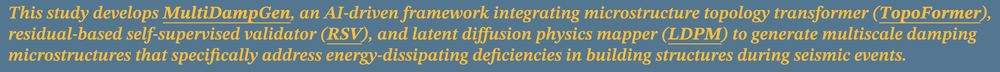
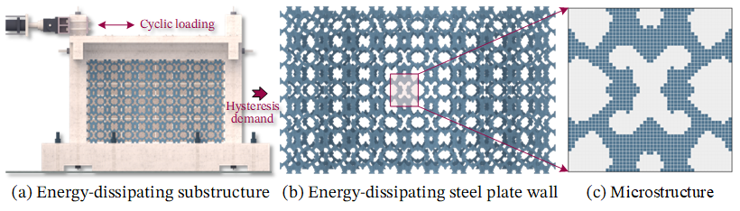
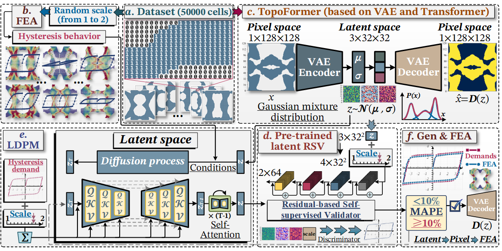
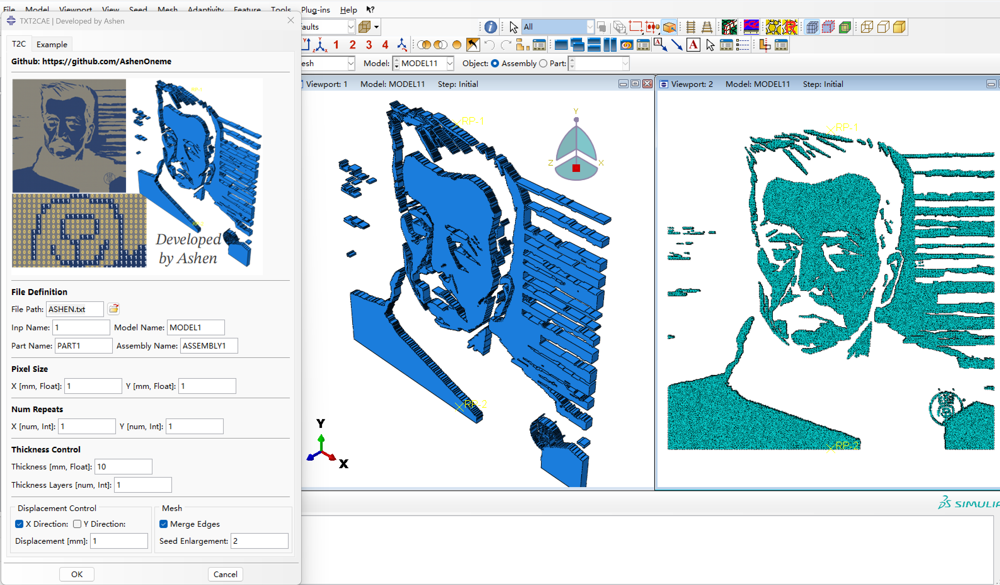
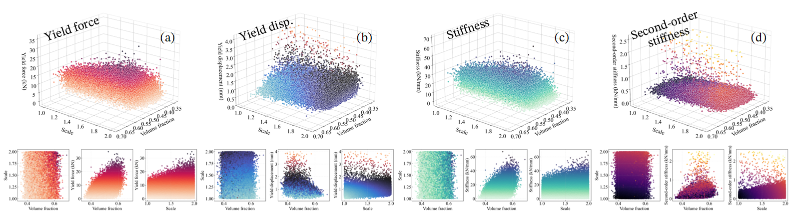
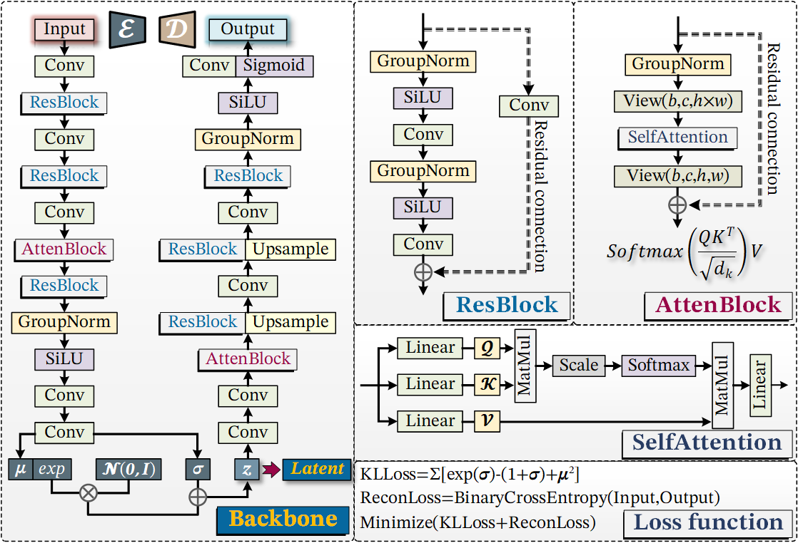
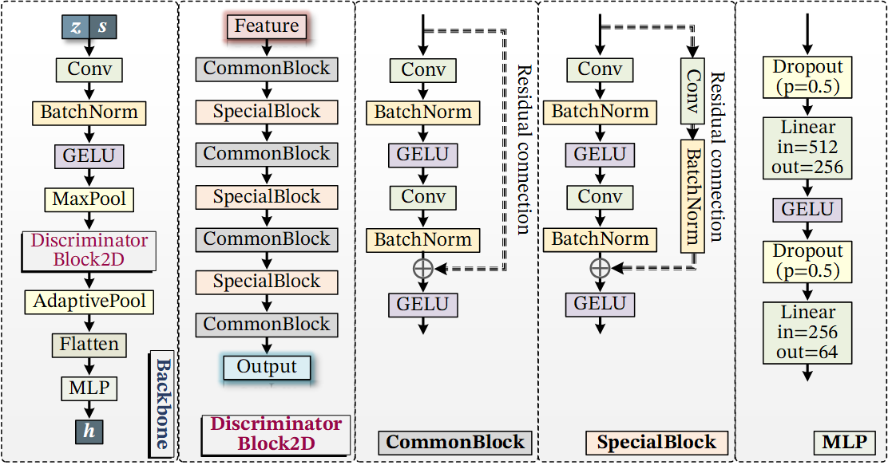
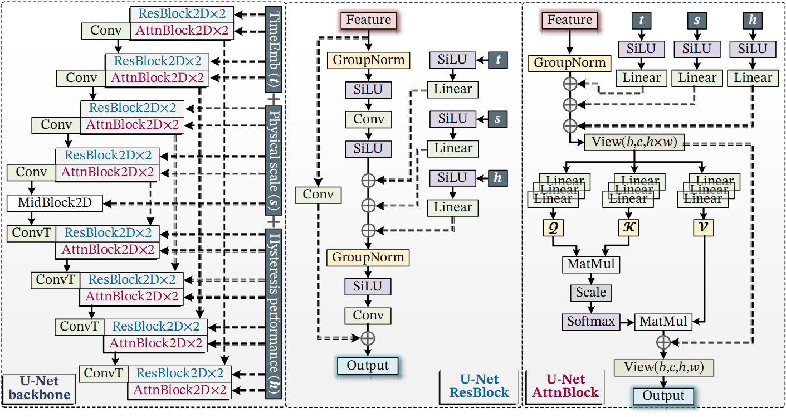
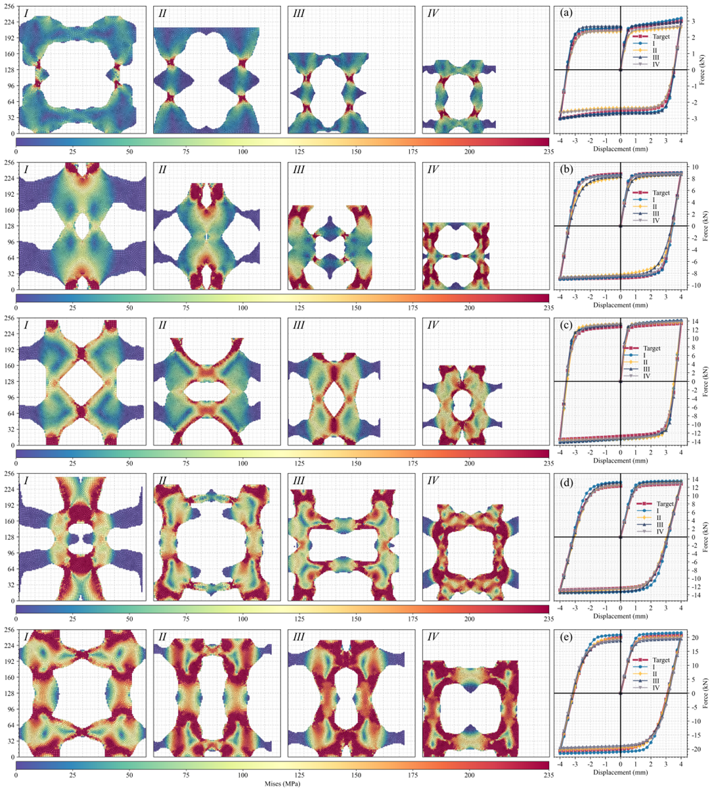

<div align=center>
  
# MultiDampGen: A Self-Supervised Latent Diffusion Framework for Multiscale Energy-Dissipating Microstructure Generation
  
</div> 

<!-- 逆向设计 -->
* ## 🧭 **_Overview of the workflow_**
<div align=center>
     
     
  
   <div align=center><strong>Fig. 1. The workflow of MultiDampGen framework</strong></div>
</div><br>    

* ## ⚛️ **_Datasets & Pre-trained models_**
  The multiscale microstructure dataset encompasses a total of *__50,000 samples__*. The dataset utilized in this study, along with the pre-trained weights of MultiDampGen, can be accessed through the link provided below.      

[**🔗The damping microstructure dataset**](https://github.com/AshenOneme/MultiDampGen/releases/tag/Dataset)     
[**🔗The weights of the MultiDampGen**](https://github.com/AshenOneme/MultiDampGen/releases/tag/Weights)

<div align=center>
  
## 🌟🌟🌟🌟🌟🌟🌟🌟🌟🌟🌟🌟🌟🌟🌟🌟🌟🌟🌟🌟          

</div> 

<!-- T2C -->
* ## 🧱 **_TXT2CAE_**          
  The TXT2CAE plugin has been developed based on the ABAQUS-Python API, enabling the generation of three-dimensional finite element models from arbitrary patterns, along with automated mesh generation. Testing has demonstrated successful operation on *__ABAQUS versions 2018 to 2020__*.
  [**🔗TXT2CAE**](https://github.com/AshenOneme/MultiDampGen/tree/main/ABQ_TXT2CAE_v1)
  
<div align=center>
  
  
   <div align=center><strong>Fig. 2. The TXT2CAE GUI</strong></div>
</div><br>   

<!-- Dataset -->
* ## 🏗️ **_Dataset_**          
  A total of 50,000 sets of microstructural data were extracted, including yield strength, yield displacement, first stiffness, and second-order stiffness. The distribution relationships were subsequently plotted based on *__volume fraction__* and *__physical scale__*.
<div align=center>
  
   <div align=center><strong>Fig. 3. Distribution of mechanical properties</strong></div>
</div><br>  

<!-- Architecture of MultiDampGen -->
* ## 🏦 **_Architecture of MultiDampGen_**          
  The network architecture of MultiDampGen is detailed as follows, with TopoFormer serving as a Variational Autoencoder (VAE) structure, RSV representing a residual network structure, and LDPM designed as a UNet structure with conditional inputs. Both the VAE and LDPM incorporate self-attention mechanisms to enhance their functionality.
<div align=center>
  
   <div align=center><strong>Fig. 4. Architecture of TopoFormer</strong></div>
    
   <div align=center><strong>Fig. 5. Architecture of RSV</strong></div>
    
   <div align=center><strong>Fig. 6. Architecture of LDPM</strong></div>
</div><br>  

<!-- Generation process -->
* ## 🔬 **_Generation process_**          
  The generation process of multiscale microstructures is illustrated in the figure, with the *__red line__* representing the specified mechanical performance demands. The scales of the microstructures are randomly determined, and the generation results at each timestep are evaluated through finite element analysis. It can be observed that the hysteretic performance, indicated by the *__blue line__*, progressively approaches the target demands.
<div align=center>
  
   <div align=center><strong>Fig. 7. The generation process</strong></div>
</div><br> 

<!-- Generation results -->
* ## 🚀 **_Generation results_**          
  Regardless of how extreme the specified mechanical properties or scales may be, it is possible to generate microstructures that meet the demands. Additionally, by employing a latent diffusion approach, the generation efficiency has been improved significantly, achieving a square factor increase compared to the Denoising Diffusion Probabilistic Model (DDPM).
<div align=center>
  
   <div align=center><strong>Fig. 8. The generation results</strong></div>
</div><br> 

<!-- Notes -->
* ## 🔶 **_Notes_**

> *__The structure of the folder is as follows:__*
```diff
  |--Main folder
          |--MultiDampGen
                |--Dataset.py
                |--VAE.py
                |--Discriminator.py
                |--UNet.py
                |--MultiDampGen.py
+               |--TopoFormer.pt
+               |--RSV.pt
+               |--LDPM.pt
!               |--imgs.txt <<<-------Read---------
          |--Dataset                              ▲
                |--Test                           │
                      |--Dataset_Test.h5          │
                |--Train                          │
                      |--Dataset_Train.h5         │
! |--ABAQUS2018  >>>--------Call------------      │
          |--Documentation                 │      │
          |--SimulationServices            │      │
          |--SolidSQUAD_License_Servers    │      │
          |--temp                          │      │
          |--SIMULIA                       │      │
                |--Commands                │      │
                |--CAE                     │      │
                      |--2018              │      │
                      |--plugins           │      │
                            |--2018        ▼      │
+                                  |--ABQ_TXT2CAE_v1
                                          |--Example
                                          |--1.png
                                          |--2.png
                                          |--ASHEN.png
                                          |--icon.png
                                          |--ABQ_TXT2CAE.pyc
                                          |--aBQ_TXT2CAE_plugin.pyc
                                          |--aBQ_TXT2CAEDB.pyc
                                          |--aBQ_TXT2CAEDB.py
```

<details>
<summary> Architecture of TopoFormer【Click to expand】 </summary>
<pre><code class="language-python">
============================================================================================================================================
Layer (type:depth-idx)                   Input Shape               Output Shape              Param #                   Kernel Shape
============================================================================================================================================
VAE_M                                    [28, 1, 128, 128]         [28, 3, 32, 32]           --                        --
├─VAE_Encoder_M: 1-1                     [28, 1, 128, 128]         [28, 3, 32, 32]           --                        --
│    └─ModuleList: 2-1                   --                        --                        --                        --
│    │    └─Conv2d: 3-1                  [28, 1, 128, 128]         [28, 64, 128, 128]        640                       [3, 3]
│    │    └─VAE_ResidualBlock: 3-2       [28, 64, 128, 128]        [28, 64, 128, 128]        74,112                    --
│    │    └─Conv2d: 3-3                  [28, 64, 129, 129]        [28, 128, 64, 64]         73,856                    [3, 3]
│    │    └─VAE_ResidualBlock: 3-4       [28, 128, 64, 64]         [28, 128, 64, 64]         295,680                   --
│    │    └─Conv2d: 3-5                  [28, 128, 65, 65]         [28, 256, 32, 32]         295,168                   [3, 3]
│    │    └─VAE_AttentionBlock: 3-6      [28, 256, 32, 32]         [28, 256, 32, 32]         263,680                   --
│    │    └─VAE_ResidualBlock: 3-7       [28, 256, 32, 32]         [28, 256, 32, 32]         1,181,184                 --
│    │    └─GroupNorm: 3-8               [28, 256, 32, 32]         [28, 256, 32, 32]         512                       --
│    │    └─SiLU: 3-9                    [28, 256, 32, 32]         [28, 256, 32, 32]         --                        --
│    │    └─Conv2d: 3-10                 [28, 256, 32, 32]         [28, 64, 32, 32]          147,520                   [3, 3]
│    │    └─Conv2d: 3-11                 [28, 64, 32, 32]          [28, 6, 32, 32]           390                       [1, 1]
├─VAE_Decoder_M: 1-2                     [28, 3, 32, 32]           [28, 1, 128, 128]         --                        --
│    └─ModuleList: 2-2                   --                        --                        --                        --
│    │    └─Conv2d: 3-12                 [28, 3, 32, 32]           [28, 64, 32, 32]          256                       [1, 1]
│    │    └─Conv2d: 3-13                 [28, 64, 32, 32]          [28, 256, 32, 32]         147,712                   [3, 3]
│    │    └─VAE_AttentionBlock: 3-14     [28, 256, 32, 32]         [28, 256, 32, 32]         263,680                   --
│    │    └─VAE_ResidualBlock: 3-15      [28, 256, 32, 32]         [28, 256, 32, 32]         1,181,184                 --
│    │    └─Upsample: 3-16               [28, 256, 32, 32]         [28, 256, 64, 64]         --                        --
│    │    └─Conv2d: 3-17                 [28, 256, 64, 64]         [28, 128, 64, 64]         295,040                   [3, 3]
│    │    └─VAE_ResidualBlock: 3-18      [28, 128, 64, 64]         [28, 128, 64, 64]         295,680                   --
│    │    └─Upsample: 3-19               [28, 128, 64, 64]         [28, 128, 128, 128]       --                        --
│    │    └─Conv2d: 3-20                 [28, 128, 128, 128]       [28, 128, 128, 128]       147,584                   [3, 3]
│    │    └─VAE_ResidualBlock: 3-21      [28, 128, 128, 128]       [28, 128, 128, 128]       295,680                   --
│    │    └─GroupNorm: 3-22              [28, 128, 128, 128]       [28, 128, 128, 128]       256                       --
│    │    └─SiLU: 3-23                   [28, 128, 128, 128]       [28, 128, 128, 128]       --                        --
│    │    └─Conv2d: 3-24                 [28, 128, 128, 128]       [28, 1, 128, 128]         1,153                     [3, 3]
│    │    └─Sigmoid: 3-25                [28, 1, 128, 128]         [28, 1, 128, 128]         --                        --
============================================================================================================================================
Total params: 4,960,967
Trainable params: 4,960,967
Non-trainable params: 0
Total mult-adds (Units.GIGABYTES): 432.47
============================================================================================================================================
Input size (MB): 1.84
Forward/backward pass size (MB): 6434.91
Params size (MB): 19.84
Estimated Total Size (MB): 6456.59
============================================================================================================================================
</code></pre>
</details>

<details>
<summary> Architecture of RSV【Click to expand】 </summary>
<pre><code class="language-python">
============================================================================================================================================
Layer (type:depth-idx)                   Input Shape               Output Shape              Param #                   Kernel Shape
============================================================================================================================================
Discriminator                            [28, 4, 32, 32]           [28, 64]                  --                        --
├─Sequential: 1-1                        [28, 4, 32, 32]           [28, 64, 32, 32]          --                        --
│    └─Conv2d: 2-1                       [28, 4, 32, 32]           [28, 64, 32, 32]          12,608                    [7, 7]
│    └─BatchNorm2d: 2-2                  [28, 64, 32, 32]          [28, 64, 32, 32]          128                       --
│    └─GELU: 2-3                         [28, 64, 32, 32]          [28, 64, 32, 32]          --                        --
│    └─MaxPool2d: 2-4                    [28, 64, 32, 32]          [28, 64, 32, 32]          --                        3
├─Sequential: 1-2                        [28, 64, 32, 32]          [28, 64, 32, 32]          --                        --
│    └─CommonBlock: 2-5                  [28, 64, 32, 32]          [28, 64, 32, 32]          --                        --
│    │    └─Conv2d: 3-1                  [28, 64, 32, 32]          [28, 64, 32, 32]          36,864                    [3, 3]
│    │    └─BatchNorm2d: 3-2             [28, 64, 32, 32]          [28, 64, 32, 32]          128                       --
│    │    └─Conv2d: 3-3                  [28, 64, 32, 32]          [28, 64, 32, 32]          36,864                    [3, 3]
│    │    └─BatchNorm2d: 3-4             [28, 64, 32, 32]          [28, 64, 32, 32]          128                       --
│    └─CommonBlock: 2-6                  [28, 64, 32, 32]          [28, 64, 32, 32]          --                        --
│    │    └─Conv2d: 3-5                  [28, 64, 32, 32]          [28, 64, 32, 32]          36,864                    [3, 3]
│    │    └─BatchNorm2d: 3-6             [28, 64, 32, 32]          [28, 64, 32, 32]          128                       --
│    │    └─Conv2d: 3-7                  [28, 64, 32, 32]          [28, 64, 32, 32]          36,864                    [3, 3]
│    │    └─BatchNorm2d: 3-8             [28, 64, 32, 32]          [28, 64, 32, 32]          128                       --
├─Sequential: 1-3                        [28, 64, 32, 32]          [28, 128, 32, 32]         --                        --
│    └─SpecialBlock: 2-7                 [28, 64, 32, 32]          [28, 128, 32, 32]         --                        --
│    │    └─Sequential: 3-9              [28, 64, 32, 32]          [28, 128, 32, 32]         8,448                     --
│    │    └─Conv2d: 3-10                 [28, 64, 32, 32]          [28, 128, 32, 32]         73,728                    [3, 3]
│    │    └─BatchNorm2d: 3-11            [28, 128, 32, 32]         [28, 128, 32, 32]         256                       --
│    │    └─Conv2d: 3-12                 [28, 128, 32, 32]         [28, 128, 32, 32]         147,456                   [3, 3]
│    │    └─BatchNorm2d: 3-13            [28, 128, 32, 32]         [28, 128, 32, 32]         256                       --
│    └─CommonBlock: 2-8                  [28, 128, 32, 32]         [28, 128, 32, 32]         --                        --
│    │    └─Conv2d: 3-14                 [28, 128, 32, 32]         [28, 128, 32, 32]         147,456                   [3, 3]
│    │    └─BatchNorm2d: 3-15            [28, 128, 32, 32]         [28, 128, 32, 32]         256                       --
│    │    └─Conv2d: 3-16                 [28, 128, 32, 32]         [28, 128, 32, 32]         147,456                   [3, 3]
│    │    └─BatchNorm2d: 3-17            [28, 128, 32, 32]         [28, 128, 32, 32]         256                       --
├─Sequential: 1-4                        [28, 128, 32, 32]         [28, 256, 32, 32]         --                        --
│    └─SpecialBlock: 2-9                 [28, 128, 32, 32]         [28, 256, 32, 32]         --                        --
│    │    └─Sequential: 3-18             [28, 128, 32, 32]         [28, 256, 32, 32]         33,280                    --
│    │    └─Conv2d: 3-19                 [28, 128, 32, 32]         [28, 256, 32, 32]         294,912                   [3, 3]
│    │    └─BatchNorm2d: 3-20            [28, 256, 32, 32]         [28, 256, 32, 32]         512                       --
│    │    └─Conv2d: 3-21                 [28, 256, 32, 32]         [28, 256, 32, 32]         589,824                   [3, 3]
│    │    └─BatchNorm2d: 3-22            [28, 256, 32, 32]         [28, 256, 32, 32]         512                       --
│    └─CommonBlock: 2-10                 [28, 256, 32, 32]         [28, 256, 32, 32]         --                        --
│    │    └─Conv2d: 3-23                 [28, 256, 32, 32]         [28, 256, 32, 32]         589,824                   [3, 3]
│    │    └─BatchNorm2d: 3-24            [28, 256, 32, 32]         [28, 256, 32, 32]         512                       --
│    │    └─Conv2d: 3-25                 [28, 256, 32, 32]         [28, 256, 32, 32]         589,824                   [3, 3]
│    │    └─BatchNorm2d: 3-26            [28, 256, 32, 32]         [28, 256, 32, 32]         512                       --
├─Sequential: 1-5                        [28, 256, 32, 32]         [28, 512, 32, 32]         --                        --
│    └─SpecialBlock: 2-11                [28, 256, 32, 32]         [28, 512, 32, 32]         --                        --
│    │    └─Sequential: 3-27             [28, 256, 32, 32]         [28, 512, 32, 32]         132,096                   --
│    │    └─Conv2d: 3-28                 [28, 256, 32, 32]         [28, 512, 32, 32]         1,179,648                 [3, 3]
│    │    └─BatchNorm2d: 3-29            [28, 512, 32, 32]         [28, 512, 32, 32]         1,024                     --
│    │    └─Conv2d: 3-30                 [28, 512, 32, 32]         [28, 512, 32, 32]         2,359,296                 [3, 3]
│    │    └─BatchNorm2d: 3-31            [28, 512, 32, 32]         [28, 512, 32, 32]         1,024                     --
│    └─CommonBlock: 2-12                 [28, 512, 32, 32]         [28, 512, 32, 32]         --                        --
│    │    └─Conv2d: 3-32                 [28, 512, 32, 32]         [28, 512, 32, 32]         2,359,296                 [3, 3]
│    │    └─BatchNorm2d: 3-33            [28, 512, 32, 32]         [28, 512, 32, 32]         1,024                     --
│    │    └─Conv2d: 3-34                 [28, 512, 32, 32]         [28, 512, 32, 32]         2,359,296                 [3, 3]
│    │    └─BatchNorm2d: 3-35            [28, 512, 32, 32]         [28, 512, 32, 32]         1,024                     --
├─AdaptiveAvgPool2d: 1-6                 [28, 512, 32, 32]         [28, 512, 1, 1]           --                        --
├─Sequential: 1-7                        [28, 512]                 [28, 64]                  --                        --
│    └─Dropout: 2-13                     [28, 512]                 [28, 512]                 --                        --
│    └─Linear: 2-14                      [28, 512]                 [28, 256]                 131,328                   --
│    └─GELU: 2-15                        [28, 256]                 [28, 256]                 --                        --
│    └─Dropout: 2-16                     [28, 256]                 [28, 256]                 --                        --
│    └─Linear: 2-17                      [28, 256]                 [28, 64]                  16,448                    --
============================================================================================================================================
Total params: 11,327,488
Trainable params: 11,327,488
Non-trainable params: 0
Total mult-adds (Units.GIGABYTES): 320.27
============================================================================================================================================
Input size (MB): 0.46
Forward/backward pass size (MB): 2202.08
Params size (MB): 45.31
Estimated Total Size (MB): 2247.85
============================================================================================================================================
</code></pre>
</details>

<details>
<summary> Architecture of LDPM【Click to expand】 </summary>
<pre><code class="language-python">
=================================================================================================================================================
Layer (type:depth-idx)                        Input Shape               Output Shape              Param #                   Kernel Shape
=================================================================================================================================================
ClassConditionedUnet_M                        [28, 3, 32, 32]           [28, 3, 32, 32]           --                        --
├─TimeEmbedding: 1-1                          [28]                      [28, 128]                 --                        --
│    └─Linear: 2-1                            [28, 128]                 [28, 128]                 16,512                    --
│    └─Swish: 2-2                             [28, 128]                 [28, 128]                 --                        --
│    └─Linear: 2-3                            [28, 128]                 [28, 128]                 16,512                    --
├─Linear: 1-2                                 [28, 64]                  [28, 128]                 8,320                     --
├─Linear: 1-3                                 [28, 1]                   [28, 128]                 256                       --
├─ModuleList: 1-4                             --                        --                        --                        --
│    └─SwitchSequential: 2-4                  [28, 3, 32, 32]           [28, 64, 32, 32]          --                        --
│    │    └─Conv2d: 3-1                       [28, 3, 32, 32]           [28, 64, 32, 32]          1,792                     [3, 3]
│    └─SwitchSequential: 2-5                  [28, 64, 32, 32]          [28, 64, 32, 32]          --                        --
│    │    └─UNet_ResidualBlock: 3-2           [28, 64, 32, 32]          [28, 64, 32, 32]          98,880                    --
│    │    └─UNet_ResidualBlock: 3-3           [28, 64, 32, 32]          [28, 64, 32, 32]          98,880                    --
│    │    └─UNet_AttentionBlock: 3-4          [28, 64, 32, 32]          [28, 64, 32, 32]          35,320                    --
│    │    └─UNet_AttentionBlock: 3-5          [28, 64, 32, 32]          [28, 64, 32, 32]          35,320                    --
│    └─SwitchSequential: 2-6                  [28, 64, 32, 32]          [28, 64, 32, 32]          --                        --
│    │    └─UNet_ResidualBlock: 3-6           [28, 64, 32, 32]          [28, 64, 32, 32]          98,880                    --
│    │    └─UNet_ResidualBlock: 3-7           [28, 64, 32, 32]          [28, 64, 32, 32]          98,880                    --
│    │    └─UNet_AttentionBlock: 3-8          [28, 64, 32, 32]          [28, 64, 32, 32]          35,320                    --
│    │    └─UNet_AttentionBlock: 3-9          [28, 64, 32, 32]          [28, 64, 32, 32]          35,320                    --
│    └─SwitchSequential: 2-7                  [28, 64, 32, 32]          [28, 128, 16, 16]         --                        --
│    │    └─Conv2d: 3-10                      [28, 64, 32, 32]          [28, 128, 16, 16]         73,856                    [3, 3]
│    └─SwitchSequential: 2-8                  [28, 128, 16, 16]         [28, 128, 16, 16]         --                        --
│    │    └─UNet_ResidualBlock: 3-11          [28, 128, 16, 16]         [28, 128, 16, 16]         345,216                   --
│    │    └─UNet_ResidualBlock: 3-12          [28, 128, 16, 16]         [28, 128, 16, 16]         345,216                   --
│    │    └─UNet_AttentionBlock: 3-13         [28, 128, 16, 16]         [28, 128, 16, 16]         91,120                    --
│    │    └─UNet_AttentionBlock: 3-14         [28, 128, 16, 16]         [28, 128, 16, 16]         91,120                    --
│    └─SwitchSequential: 2-9                  [28, 128, 16, 16]         [28, 128, 16, 16]         --                        --
│    │    └─UNet_ResidualBlock: 3-15          [28, 128, 16, 16]         [28, 128, 16, 16]         345,216                   --
│    │    └─UNet_ResidualBlock: 3-16          [28, 128, 16, 16]         [28, 128, 16, 16]         345,216                   --
│    │    └─UNet_AttentionBlock: 3-17         [28, 128, 16, 16]         [28, 128, 16, 16]         91,120                    --
│    │    └─UNet_AttentionBlock: 3-18         [28, 128, 16, 16]         [28, 128, 16, 16]         91,120                    --
│    └─SwitchSequential: 2-10                 [28, 128, 16, 16]         [28, 256, 8, 8]           --                        --
│    │    └─Conv2d: 3-19                      [28, 128, 16, 16]         [28, 256, 8, 8]           295,168                   [3, 3]
│    └─SwitchSequential: 2-11                 [28, 256, 8, 8]           [28, 256, 8, 8]           --                        --
│    │    └─UNet_ResidualBlock: 3-20          [28, 256, 8, 8]           [28, 256, 8, 8]           1,280,256                 --
│    │    └─UNet_ResidualBlock: 3-21          [28, 256, 8, 8]           [28, 256, 8, 8]           1,280,256                 --
│    │    └─UNet_AttentionBlock: 3-22         [28, 256, 8, 8]           [28, 256, 8, 8]           223,080                   --
│    │    └─UNet_AttentionBlock: 3-23         [28, 256, 8, 8]           [28, 256, 8, 8]           223,080                   --
│    └─SwitchSequential: 2-12                 [28, 256, 8, 8]           [28, 256, 8, 8]           --                        --
│    │    └─UNet_ResidualBlock: 3-24          [28, 256, 8, 8]           [28, 256, 8, 8]           1,280,256                 --
│    │    └─UNet_ResidualBlock: 3-25          [28, 256, 8, 8]           [28, 256, 8, 8]           1,280,256                 --
│    │    └─UNet_AttentionBlock: 3-26         [28, 256, 8, 8]           [28, 256, 8, 8]           223,080                   --
│    │    └─UNet_AttentionBlock: 3-27         [28, 256, 8, 8]           [28, 256, 8, 8]           223,080                   --
│    └─SwitchSequential: 2-13                 [28, 256, 8, 8]           [28, 256, 8, 8]           --                        --
│    │    └─Conv2d: 3-28                      [28, 256, 8, 8]           [28, 256, 8, 8]           590,080                   [3, 3]
│    └─SwitchSequential: 2-14                 [28, 256, 8, 8]           [28, 256, 8, 8]           --                        --
│    │    └─UNet_ResidualBlock: 3-29          [28, 256, 8, 8]           [28, 256, 8, 8]           1,280,256                 --
│    │    └─UNet_ResidualBlock: 3-30          [28, 256, 8, 8]           [28, 256, 8, 8]           1,280,256                 --
│    │    └─UNet_AttentionBlock: 3-31         [28, 256, 8, 8]           [28, 256, 8, 8]           223,080                   --
│    │    └─UNet_AttentionBlock: 3-32         [28, 256, 8, 8]           [28, 256, 8, 8]           223,080                   --
│    └─SwitchSequential: 2-15                 [28, 256, 8, 8]           [28, 256, 8, 8]           --                        --
│    │    └─UNet_ResidualBlock: 3-33          [28, 256, 8, 8]           [28, 256, 8, 8]           1,280,256                 --
│    │    └─UNet_ResidualBlock: 3-34          [28, 256, 8, 8]           [28, 256, 8, 8]           1,280,256                 --
│    │    └─UNet_AttentionBlock: 3-35         [28, 256, 8, 8]           [28, 256, 8, 8]           223,080                   --
│    │    └─UNet_AttentionBlock: 3-36         [28, 256, 8, 8]           [28, 256, 8, 8]           223,080                   --
├─SwitchSequential: 1-5                       [28, 256, 8, 8]           [28, 256, 8, 8]           --                        --
│    └─UNet_ResidualBlock: 2-16               [28, 256, 8, 8]           [28, 256, 8, 8]           33,024                    --
│    │    └─GroupNorm: 3-37                   [28, 256, 8, 8]           [28, 256, 8, 8]           512                       --
│    │    └─Conv2d: 3-38                      [28, 256, 8, 8]           [28, 256, 8, 8]           590,080                   [3, 3]
│    │    └─Linear: 3-39                      [28, 128]                 [28, 256]                 33,024                    --
│    │    └─Linear: 3-40                      [28, 128]                 [28, 256]                 33,024                    --
│    │    └─Linear: 3-41                      [28, 128]                 [28, 256]                 (recursive)               --
│    │    └─GroupNorm: 3-42                   [28, 256, 8, 8]           [28, 256, 8, 8]           512                       --
│    │    └─Conv2d: 3-43                      [28, 256, 8, 8]           [28, 256, 8, 8]           590,080                   [3, 3]
│    │    └─Identity: 3-44                    [28, 256, 8, 8]           [28, 256, 8, 8]           --                        --
│    └─UNet_ResidualBlock: 2-17               [28, 256, 8, 8]           [28, 256, 8, 8]           33,024                    --
│    │    └─GroupNorm: 3-45                   [28, 256, 8, 8]           [28, 256, 8, 8]           512                       --
│    │    └─Conv2d: 3-46                      [28, 256, 8, 8]           [28, 256, 8, 8]           590,080                   [3, 3]
│    │    └─Linear: 3-47                      [28, 128]                 [28, 256]                 33,024                    --
│    │    └─Linear: 3-48                      [28, 128]                 [28, 256]                 33,024                    --
│    │    └─Linear: 3-49                      [28, 128]                 [28, 256]                 (recursive)               --
│    │    └─GroupNorm: 3-50                   [28, 256, 8, 8]           [28, 256, 8, 8]           512                       --
│    │    └─Conv2d: 3-51                      [28, 256, 8, 8]           [28, 256, 8, 8]           590,080                   [3, 3]
│    │    └─Identity: 3-52                    [28, 256, 8, 8]           [28, 256, 8, 8]           --                        --
│    └─UNet_AttentionBlock: 2-18              [28, 256, 8, 8]           [28, 256, 8, 8]           --                        --
│    │    └─GroupNorm: 3-53                   [28, 256, 8, 8]           [28, 256, 8, 8]           512                       --
│    │    └─Linear: 3-54                      [28, 128]                 [28, 256]                 33,024                    --
│    │    └─Linear: 3-55                      [28, 128]                 [28, 256]                 33,024                    --
│    │    └─Linear: 3-56                      [28, 128]                 [28, 256]                 33,024                    --
│    │    └─Linear: 3-57                      [28, 64, 256]             [28, 64, 360]             92,520                    --
│    │    └─Linear: 3-58                      [28, 64, 120]             [28, 64, 256]             30,976                    --
│    └─UNet_AttentionBlock: 2-19              [28, 256, 8, 8]           [28, 256, 8, 8]           --                        --
│    │    └─GroupNorm: 3-59                   [28, 256, 8, 8]           [28, 256, 8, 8]           512                       --
│    │    └─Linear: 3-60                      [28, 128]                 [28, 256]                 33,024                    --
│    │    └─Linear: 3-61                      [28, 128]                 [28, 256]                 33,024                    --
│    │    └─Linear: 3-62                      [28, 128]                 [28, 256]                 33,024                    --
│    │    └─Linear: 3-63                      [28, 64, 256]             [28, 64, 360]             92,520                    --
│    │    └─Linear: 3-64                      [28, 64, 120]             [28, 64, 256]             30,976                    --
├─ModuleList: 1-6                             --                        --                        --                        --
│    └─SwitchSequential: 2-20                 [28, 512, 8, 8]           [28, 256, 8, 8]           --                        --
│    │    └─UNet_ResidualBlock: 3-65          [28, 512, 8, 8]           [28, 256, 8, 8]           2,001,920                 --
│    │    └─UNet_ResidualBlock: 3-66          [28, 256, 8, 8]           [28, 256, 8, 8]           1,280,256                 --
│    │    └─UNet_AttentionBlock: 3-67         [28, 256, 8, 8]           [28, 256, 8, 8]           223,080                   --
│    │    └─UNet_AttentionBlock: 3-68         [28, 256, 8, 8]           [28, 256, 8, 8]           223,080                   --
│    └─SwitchSequential: 2-21                 [28, 512, 8, 8]           [28, 256, 8, 8]           --                        --
│    │    └─UNet_ResidualBlock: 3-69          [28, 512, 8, 8]           [28, 256, 8, 8]           2,001,920                 --
│    │    └─UNet_ResidualBlock: 3-70          [28, 256, 8, 8]           [28, 256, 8, 8]           1,280,256                 --
│    │    └─UNet_AttentionBlock: 3-71         [28, 256, 8, 8]           [28, 256, 8, 8]           223,080                   --
│    │    └─UNet_AttentionBlock: 3-72         [28, 256, 8, 8]           [28, 256, 8, 8]           223,080                   --
│    └─SwitchSequential: 2-22                 [28, 512, 8, 8]           [28, 256, 8, 8]           --                        --
│    │    └─ConvTranspose2d: 3-73             [28, 512, 8, 8]           [28, 256, 8, 8]           1,179,904                 [3, 3]
│    └─SwitchSequential: 2-23                 [28, 512, 8, 8]           [28, 256, 8, 8]           --                        --
│    │    └─UNet_ResidualBlock: 3-74          [28, 512, 8, 8]           [28, 256, 8, 8]           2,001,920                 --
│    │    └─UNet_ResidualBlock: 3-75          [28, 256, 8, 8]           [28, 256, 8, 8]           1,280,256                 --
│    │    └─UNet_AttentionBlock: 3-76         [28, 256, 8, 8]           [28, 256, 8, 8]           223,080                   --
│    │    └─UNet_AttentionBlock: 3-77         [28, 256, 8, 8]           [28, 256, 8, 8]           223,080                   --
│    └─SwitchSequential: 2-24                 [28, 512, 8, 8]           [28, 256, 8, 8]           --                        --
│    │    └─UNet_ResidualBlock: 3-78          [28, 512, 8, 8]           [28, 256, 8, 8]           2,001,920                 --
│    │    └─UNet_ResidualBlock: 3-79          [28, 256, 8, 8]           [28, 256, 8, 8]           1,280,256                 --
│    │    └─UNet_AttentionBlock: 3-80         [28, 256, 8, 8]           [28, 256, 8, 8]           223,080                   --
│    │    └─UNet_AttentionBlock: 3-81         [28, 256, 8, 8]           [28, 256, 8, 8]           223,080                   --
│    └─SwitchSequential: 2-25                 [28, 512, 8, 8]           [28, 256, 16, 16]         --                        --
│    │    └─ConvTranspose2d: 3-82             [28, 512, 8, 8]           [28, 256, 16, 16]         2,097,408                 [4, 4]
│    └─SwitchSequential: 2-26                 [28, 384, 16, 16]         [28, 128, 16, 16]         --                        --
│    │    └─UNet_ResidualBlock: 3-83          [28, 384, 16, 16]         [28, 128, 16, 16]         689,920                   --
│    │    └─UNet_ResidualBlock: 3-84          [28, 128, 16, 16]         [28, 128, 16, 16]         345,216                   --
│    │    └─UNet_AttentionBlock: 3-85         [28, 128, 16, 16]         [28, 128, 16, 16]         91,120                    --
│    │    └─UNet_AttentionBlock: 3-86         [28, 128, 16, 16]         [28, 128, 16, 16]         91,120                    --
│    └─SwitchSequential: 2-27                 [28, 256, 16, 16]         [28, 128, 16, 16]         --                        --
│    │    └─UNet_ResidualBlock: 3-87          [28, 256, 16, 16]         [28, 128, 16, 16]         525,824                   --
│    │    └─UNet_ResidualBlock: 3-88          [28, 128, 16, 16]         [28, 128, 16, 16]         345,216                   --
│    │    └─UNet_AttentionBlock: 3-89         [28, 128, 16, 16]         [28, 128, 16, 16]         91,120                    --
│    │    └─UNet_AttentionBlock: 3-90         [28, 128, 16, 16]         [28, 128, 16, 16]         91,120                    --
│    └─SwitchSequential: 2-28                 [28, 256, 16, 16]         [28, 128, 31, 31]         --                        --
│    │    └─ConvTranspose2d: 3-91             [28, 256, 16, 16]         [28, 128, 31, 31]         295,040                   [3, 3]
│    └─SwitchSequential: 2-29                 [28, 192, 32, 32]         [28, 64, 32, 32]          --                        --
│    │    └─UNet_ResidualBlock: 3-92          [28, 192, 32, 32]         [28, 64, 32, 32]          185,216                   --
│    │    └─UNet_ResidualBlock: 3-93          [28, 64, 32, 32]          [28, 64, 32, 32]          98,880                    --
│    │    └─UNet_AttentionBlock: 3-94         [28, 64, 32, 32]          [28, 64, 32, 32]          35,320                    --
│    │    └─UNet_AttentionBlock: 3-95         [28, 64, 32, 32]          [28, 64, 32, 32]          35,320                    --
│    └─SwitchSequential: 2-30                 [28, 128, 32, 32]         [28, 64, 32, 32]          --                        --
│    │    └─UNet_ResidualBlock: 3-96          [28, 128, 32, 32]         [28, 64, 32, 32]          144,128                   --
│    │    └─UNet_ResidualBlock: 3-97          [28, 64, 32, 32]          [28, 64, 32, 32]          98,880                    --
│    │    └─UNet_AttentionBlock: 3-98         [28, 64, 32, 32]          [28, 64, 32, 32]          35,320                    --
│    │    └─UNet_AttentionBlock: 3-99         [28, 64, 32, 32]          [28, 64, 32, 32]          35,320                    --
│    └─SwitchSequential: 2-31                 [28, 128, 32, 32]         [28, 3, 32, 32]           --                        --
│    │    └─ConvTranspose2d: 3-100            [28, 128, 32, 32]         [28, 3, 32, 32]           3,459                     [3, 3]
=================================================================================================================================================
Total params: 39,746,195
Trainable params: 39,746,195
Non-trainable params: 0
Total mult-adds (Units.GIGABYTES): 112.19
=================================================================================================================================================
Input size (MB): 0.35
Forward/backward pass size (MB): 2100.31
Params size (MB): 155.81
Estimated Total Size (MB): 2256.48
=================================================================================================================================================
</code></pre>
</details>


* ## 🌟 **_Stargazers Wall_**

<!-- WALL_START -->
<div align="center">

<table style="margin: 0 auto;">
<tr style="vertical-align: top;">

<td style="padding: 5px; text-align: center;">  <!-- 减小间距 -->
  <a href="https://github.com/17092d67763" 
     title="17092d67763"
     onmouseover="this.children[0].style.transform='scale(1.1)'" 
     onmouseout="this.children[0].style.transform='scale(1)'">
    
  </a>
</td>
            

<td style="padding: 5px; text-align: center;">  <!-- 减小间距 -->
  <a href="https://github.com/YijieCai" 
     title="YijieCai"
     onmouseover="this.children[0].style.transform='scale(1.1)'" 
     onmouseout="this.children[0].style.transform='scale(1)'">
    
  </a>
</td>
            

<td style="padding: 5px; text-align: center;">  <!-- 减小间距 -->
  <a href="https://github.com/ecyaJayce" 
     title="ecyaJayce"
     onmouseover="this.children[0].style.transform='scale(1.1)'" 
     onmouseout="this.children[0].style.transform='scale(1)'">
    
  </a>
</td>
            

<td style="padding: 5px; text-align: center;">  <!-- 减小间距 -->
  <a href="https://github.com/kiyomimm" 
     title="kiyomimm"
     onmouseover="this.children[0].style.transform='scale(1.1)'" 
     onmouseout="this.children[0].style.transform='scale(1)'">
    
  </a>
</td>
            

<td style="padding: 5px; text-align: center;">  <!-- 减小间距 -->
  <a href="https://github.com/quihaawlishui20" 
     title="quihaawlishui20"
     onmouseover="this.children[0].style.transform='scale(1.1)'" 
     onmouseout="this.children[0].style.transform='scale(1)'">
    
  </a>
</td>
            

<td style="padding: 5px; text-align: center;">  <!-- 减小间距 -->
  <a href="https://github.com/zhangzhiwei1013" 
     title="zhangzhiwei1013"
     onmouseover="this.children[0].style.transform='scale(1.1)'" 
     onmouseout="this.children[0].style.transform='scale(1)'">
    
  </a>
</td>
            

<td style="padding: 5px; text-align: center;">  <!-- 减小间距 -->
  <a href="https://github.com/AshenOneme" 
     title="AshenOneme"
     onmouseover="this.children[0].style.transform='scale(1.1)'" 
     onmouseout="this.children[0].style.transform='scale(1)'">
    
  </a>
</td>
            

<td style="padding: 5px; text-align: center;">  <!-- 减小间距 -->
  <a href="https://github.com/359442094j" 
     title="359442094j"
     onmouseover="this.children[0].style.transform='scale(1.1)'" 
     onmouseout="this.children[0].style.transform='scale(1)'">
    
  </a>
</td>
            

<td style="padding: 5px; text-align: center;">  <!-- 减小间距 -->
  <a href="https://github.com/OneJanesh" 
     title="OneJanesh"
     onmouseover="this.children[0].style.transform='scale(1.1)'" 
     onmouseout="this.children[0].style.transform='scale(1)'">
    
  </a>
</td>
            

<td style="padding: 5px; text-align: center;">  <!-- 减小间距 -->
  <a href="https://github.com/blus3artup" 
     title="blus3artup"
     onmouseover="this.children[0].style.transform='scale(1.1)'" 
     onmouseout="this.children[0].style.transform='scale(1)'">
    
  </a>
</td>
            
</tr>
<tr style="vertical-align: top;">

<td style="padding: 5px; text-align: center;">  <!-- 减小间距 -->
  <a href="https://github.com/fbhao58201" 
     title="fbhao58201"
     onmouseover="this.children[0].style.transform='scale(1.1)'" 
     onmouseout="this.children[0].style.transform='scale(1)'">
    
  </a>
</td>
            

<td style="padding: 5px; text-align: center;">  <!-- 减小间距 -->
  <a href="https://github.com/kukule75gmails" 
     title="kukule75gmails"
     onmouseover="this.children[0].style.transform='scale(1.1)'" 
     onmouseout="this.children[0].style.transform='scale(1)'">
    
  </a>
</td>
            

<td style="padding: 5px; text-align: center;">  <!-- 减小间距 -->
  <a href="https://github.com/zyueguoshanqiu3" 
     title="zyueguoshanqiu3"
     onmouseover="this.children[0].style.transform='scale(1.1)'" 
     onmouseout="this.children[0].style.transform='scale(1)'">
    
  </a>
</td>
            

<td style="padding: 5px; text-align: center;">  <!-- 减小间距 -->
  <a href="https://github.com/s20180029" 
     title="s20180029"
     onmouseover="this.children[0].style.transform='scale(1.1)'" 
     onmouseout="this.children[0].style.transform='scale(1)'">
    
  </a>
</td>
            

<td style="padding: 5px; text-align: center;">  <!-- 减小间距 -->
  <a href="https://github.com/kyrsemtx" 
     title="kyrsemtx"
     onmouseover="this.children[0].style.transform='scale(1.1)'" 
     onmouseout="this.children[0].style.transform='scale(1)'">
    
  </a>
</td>
            

<td style="padding: 5px; text-align: center;">  <!-- 减小间距 -->
  <a href="https://github.com/chenshiy3n" 
     title="chenshiy3n"
     onmouseover="this.children[0].style.transform='scale(1.1)'" 
     onmouseout="this.children[0].style.transform='scale(1)'">
    
  </a>
</td>
            

<td style="padding: 5px; text-align: center;">  <!-- 减小间距 -->
  <a href="https://github.com/MiderWong5ddop" 
     title="MiderWong5ddop"
     onmouseover="this.children[0].style.transform='scale(1.1)'" 
     onmouseout="this.children[0].style.transform='scale(1)'">
    
  </a>
</td>
            

<td style="padding: 5px; text-align: center;">  <!-- 减小间距 -->
  <a href="https://github.com/113079767qqc" 
     title="113079767qqc"
     onmouseover="this.children[0].style.transform='scale(1.1)'" 
     onmouseout="this.children[0].style.transform='scale(1)'">
    
  </a>
</td>
            

<td style="padding: 5px; text-align: center;">  <!-- 减小间距 -->
  <a href="https://github.com/rycwo7" 
     title="rycwo7"
     onmouseover="this.children[0].style.transform='scale(1.1)'" 
     onmouseout="this.children[0].style.transform='scale(1)'">
    
  </a>
</td>
            

<td style="padding: 5px; text-align: center;">  <!-- 减小间距 -->
  <a href="https://github.com/cocomm1995mstt9tt" 
     title="cocomm1995mstt9tt"
     onmouseover="this.children[0].style.transform='scale(1.1)'" 
     onmouseout="this.children[0].style.transform='scale(1)'">
    
  </a>
</td>
            
</tr>
<tr style="vertical-align: top;">

<td style="padding: 5px; text-align: center;">  <!-- 减小间距 -->
  <a href="https://github.com/09544wei" 
     title="09544wei"
     onmouseover="this.children[0].style.transform='scale(1.1)'" 
     onmouseout="this.children[0].style.transform='scale(1)'">
    
  </a>
</td>
            

<td style="padding: 5px; text-align: center;">  <!-- 减小间距 -->
  <a href="https://github.com/fdw14667" 
     title="fdw14667"
     onmouseover="this.children[0].style.transform='scale(1.1)'" 
     onmouseout="this.children[0].style.transform='scale(1)'">
    
  </a>
</td>
            

<td style="padding: 5px; text-align: center;">  <!-- 减小间距 -->
  <a href="https://github.com/zhangtongkeemailmeb" 
     title="zhangtongkeemailmeb"
     onmouseover="this.children[0].style.transform='scale(1.1)'" 
     onmouseout="this.children[0].style.transform='scale(1)'">
    
  </a>
</td>
            

<td style="padding: 5px; text-align: center;">  <!-- 减小间距 -->
  <a href="https://github.com/lin-zhe3" 
     title="lin-zhe3"
     onmouseover="this.children[0].style.transform='scale(1.1)'" 
     onmouseout="this.children[0].style.transform='scale(1)'">
    
  </a>
</td>
            

<td style="padding: 5px; text-align: center;">  <!-- 减小间距 -->
  <a href="https://github.com/TheCrypticCanadiank" 
     title="TheCrypticCanadiank"
     onmouseover="this.children[0].style.transform='scale(1.1)'" 
     onmouseout="this.children[0].style.transform='scale(1)'">
    
  </a>
</td>
            

<td style="padding: 5px; text-align: center;">  <!-- 减小间距 -->
  <a href="https://github.com/sayanbrc" 
     title="sayanbrc"
     onmouseover="this.children[0].style.transform='scale(1.1)'" 
     onmouseout="this.children[0].style.transform='scale(1)'">
    
  </a>
</td>
            

<td style="padding: 5px; text-align: center;">  <!-- 减小间距 -->
  <a href="https://github.com/AttackOnMortyz" 
     title="AttackOnMortyz"
     onmouseover="this.children[0].style.transform='scale(1.1)'" 
     onmouseout="this.children[0].style.transform='scale(1)'">
    
  </a>
</td>
            

<td style="padding: 5px; text-align: center;">  <!-- 减小间距 -->
  <a href="https://github.com/Ay-355shc7v" 
     title="Ay-355shc7v"
     onmouseover="this.children[0].style.transform='scale(1.1)'" 
     onmouseout="this.children[0].style.transform='scale(1)'">
    
  </a>
</td>
            

<td style="padding: 5px; text-align: center;">  <!-- 减小间距 -->
  <a href="https://github.com/TLDayd2j0p" 
     title="TLDayd2j0p"
     onmouseover="this.children[0].style.transform='scale(1.1)'" 
     onmouseout="this.children[0].style.transform='scale(1)'">
    
  </a>
</td>
            

<td style="padding: 5px; text-align: center;">  <!-- 减小间距 -->
  <a href="https://github.com/abkp5201209" 
     title="abkp5201209"
     onmouseover="this.children[0].style.transform='scale(1.1)'" 
     onmouseout="this.children[0].style.transform='scale(1)'">
    
  </a>
</td>
            
</tr>
<tr style="vertical-align: top;">

<td style="padding: 5px; text-align: center;">  <!-- 减小间距 -->
  <a href="https://github.com/jaoxfordi" 
     title="jaoxfordi"
     onmouseover="this.children[0].style.transform='scale(1.1)'" 
     onmouseout="this.children[0].style.transform='scale(1)'">
    
  </a>
</td>
            

<td style="padding: 5px; text-align: center;">  <!-- 减小间距 -->
  <a href="https://github.com/834583220968562412" 
     title="834583220968562412"
     onmouseover="this.children[0].style.transform='scale(1.1)'" 
     onmouseout="this.children[0].style.transform='scale(1)'">
    
  </a>
</td>
            

<td style="padding: 5px; text-align: center;">  <!-- 减小间距 -->
  <a href="https://github.com/gitForTM580" 
     title="gitForTM580"
     onmouseover="this.children[0].style.transform='scale(1.1)'" 
     onmouseout="this.children[0].style.transform='scale(1)'">
    
  </a>
</td>
            

<td style="padding: 5px; text-align: center;">  <!-- 减小间距 -->
  <a href="https://github.com/clpenliebe1314" 
     title="clpenliebe1314"
     onmouseover="this.children[0].style.transform='scale(1.1)'" 
     onmouseout="this.children[0].style.transform='scale(1)'">
    
  </a>
</td>
            

<td style="padding: 5px; text-align: center;">  <!-- 减小间距 -->
  <a href="https://github.com/FaKenKoalaken0qu" 
     title="FaKenKoalaken0qu"
     onmouseover="this.children[0].style.transform='scale(1.1)'" 
     onmouseout="this.children[0].style.transform='scale(1)'">
    
  </a>
</td>
            

<td style="padding: 5px; text-align: center;">  <!-- 减小间距 -->
  <a href="https://github.com/lishuozme" 
     title="lishuozme"
     onmouseover="this.children[0].style.transform='scale(1.1)'" 
     onmouseout="this.children[0].style.transform='scale(1)'">
    
  </a>
</td>
            

<td style="padding: 5px; text-align: center;">  <!-- 减小间距 -->
  <a href="https://github.com/5iyxxz" 
     title="5iyxxz"
     onmouseover="this.children[0].style.transform='scale(1.1)'" 
     onmouseout="this.children[0].style.transform='scale(1)'">
    
  </a>
</td>
            

<td style="padding: 5px; text-align: center;">  <!-- 减小间距 -->
  <a href="https://github.com/tarikkarsik" 
     title="tarikkarsik"
     onmouseover="this.children[0].style.transform='scale(1.1)'" 
     onmouseout="this.children[0].style.transform='scale(1)'">
    
  </a>
</td>
            

<td style="padding: 5px; text-align: center;">  <!-- 减小间距 -->
  <a href="https://github.com/9idisunliu" 
     title="9idisunliu"
     onmouseover="this.children[0].style.transform='scale(1.1)'" 
     onmouseout="this.children[0].style.transform='scale(1)'">
    
  </a>
</td>
            

<td style="padding: 5px; text-align: center;">  <!-- 减小间距 -->
  <a href="https://github.com/lhp3z51" 
     title="lhp3z51"
     onmouseover="this.children[0].style.transform='scale(1.1)'" 
     onmouseout="this.children[0].style.transform='scale(1)'">
    
  </a>
</td>
            
</tr>
<tr style="vertical-align: top;">

<td style="padding: 5px; text-align: center;">  <!-- 减小间距 -->
  <a href="https://github.com/yungb4" 
     title="yungb4"
     onmouseover="this.children[0].style.transform='scale(1.1)'" 
     onmouseout="this.children[0].style.transform='scale(1)'">
    
  </a>
</td>
            

<td style="padding: 5px; text-align: center;">  <!-- 减小间距 -->
  <a href="https://github.com/battlesnakem" 
     title="battlesnakem"
     onmouseover="this.children[0].style.transform='scale(1.1)'" 
     onmouseout="this.children[0].style.transform='scale(1)'">
    
  </a>
</td>
            

<td style="padding: 5px; text-align: center;">  <!-- 减小间距 -->
  <a href="https://github.com/Phoebe-ZYY9" 
     title="Phoebe-ZYY9"
     onmouseover="this.children[0].style.transform='scale(1.1)'" 
     onmouseout="this.children[0].style.transform='scale(1)'">
    
  </a>
</td>
            

<td style="padding: 5px; text-align: center;">  <!-- 减小间距 -->
  <a href="https://github.com/tkapias0" 
     title="tkapias0"
     onmouseover="this.children[0].style.transform='scale(1.1)'" 
     onmouseout="this.children[0].style.transform='scale(1)'">
    
  </a>
</td>
            

<td style="padding: 5px; text-align: center;">  <!-- 减小间距 -->
  <a href="https://github.com/sou9cecodeGdl" 
     title="sou9cecodeGdl"
     onmouseover="this.children[0].style.transform='scale(1.1)'" 
     onmouseout="this.children[0].style.transform='scale(1)'">
    
  </a>
</td>
            

<td style="padding: 5px; text-align: center;">  <!-- 减小间距 -->
  <a href="https://github.com/DimWiohter" 
     title="DimWiohter"
     onmouseover="this.children[0].style.transform='scale(1.1)'" 
     onmouseout="this.children[0].style.transform='scale(1)'">
    
  </a>
</td>
            

<td style="padding: 5px; text-align: center;">  <!-- 减小间距 -->
  <a href="https://github.com/wengqiscb2l" 
     title="wengqiscb2l"
     onmouseover="this.children[0].style.transform='scale(1.1)'" 
     onmouseout="this.children[0].style.transform='scale(1)'">
    
  </a>
</td>
            

<td style="padding: 5px; text-align: center;">  <!-- 减小间距 -->
  <a href="https://github.com/surpasslimits7" 
     title="surpasslimits7"
     onmouseover="this.children[0].style.transform='scale(1.1)'" 
     onmouseout="this.children[0].style.transform='scale(1)'">
    
  </a>
</td>
            

<td style="padding: 5px; text-align: center;">  <!-- 减小间距 -->
  <a href="https://github.com/2sia040" 
     title="2sia040"
     onmouseover="this.children[0].style.transform='scale(1.1)'" 
     onmouseout="this.children[0].style.transform='scale(1)'">
    
  </a>
</td>
            

<td style="padding: 5px; text-align: center;">  <!-- 减小间距 -->
  <a href="https://github.com/alittlebitcool2" 
     title="alittlebitcool2"
     onmouseover="this.children[0].style.transform='scale(1.1)'" 
     onmouseout="this.children[0].style.transform='scale(1)'">
    
  </a>
</td>
            
</tr>
<tr style="vertical-align: top;">

<td style="padding: 5px; text-align: center;">  <!-- 减小间距 -->
  <a href="https://github.com/vyenheng07" 
     title="vyenheng07"
     onmouseover="this.children[0].style.transform='scale(1.1)'" 
     onmouseout="this.children[0].style.transform='scale(1)'">
    
  </a>
</td>
            

<td style="padding: 5px; text-align: center;">  <!-- 减小间距 -->
  <a href="https://github.com/aziu202" 
     title="aziu202"
     onmouseover="this.children[0].style.transform='scale(1.1)'" 
     onmouseout="this.children[0].style.transform='scale(1)'">
    
  </a>
</td>
            

<td style="padding: 5px; text-align: center;">  <!-- 减小间距 -->
  <a href="https://github.com/phrty34309" 
     title="phrty34309"
     onmouseover="this.children[0].style.transform='scale(1.1)'" 
     onmouseout="this.children[0].style.transform='scale(1)'">
    
  </a>
</td>
            

<td style="padding: 5px; text-align: center;">  <!-- 减小间距 -->
  <a href="https://github.com/MMK21Hubtbw4f" 
     title="MMK21Hubtbw4f"
     onmouseover="this.children[0].style.transform='scale(1.1)'" 
     onmouseout="this.children[0].style.transform='scale(1)'">
    
  </a>
</td>
            

<td style="padding: 5px; text-align: center;">  <!-- 减小间距 -->
  <a href="https://github.com/darkreddfly" 
     title="darkreddfly"
     onmouseover="this.children[0].style.transform='scale(1.1)'" 
     onmouseout="this.children[0].style.transform='scale(1)'">
    
  </a>
</td>
            

<td style="padding: 5px; text-align: center;">  <!-- 减小间距 -->
  <a href="https://github.com/starPxc2" 
     title="starPxc2"
     onmouseover="this.children[0].style.transform='scale(1.1)'" 
     onmouseout="this.children[0].style.transform='scale(1)'">
    
  </a>
</td>
            

<td style="padding: 5px; text-align: center;">  <!-- 减小间距 -->
  <a href="https://github.com/1027479890" 
     title="1027479890"
     onmouseover="this.children[0].style.transform='scale(1.1)'" 
     onmouseout="this.children[0].style.transform='scale(1)'">
    
  </a>
</td>
            

<td style="padding: 5px; text-align: center;">  <!-- 减小间距 -->
  <a href="https://github.com/yjk123x3210" 
     title="yjk123x3210"
     onmouseover="this.children[0].style.transform='scale(1.1)'" 
     onmouseout="this.children[0].style.transform='scale(1)'">
    
  </a>
</td>
            

<td style="padding: 5px; text-align: center;">  <!-- 减小间距 -->
  <a href="https://github.com/iwantyou12" 
     title="iwantyou12"
     onmouseover="this.children[0].style.transform='scale(1.1)'" 
     onmouseout="this.children[0].style.transform='scale(1)'">
    
  </a>
</td>
            

<td style="padding: 5px; text-align: center;">  <!-- 减小间距 -->
  <a href="https://github.com/sherryjwq" 
     title="sherryjwq"
     onmouseover="this.children[0].style.transform='scale(1.1)'" 
     onmouseout="this.children[0].style.transform='scale(1)'">
    
  </a>
</td>
            
</tr>
<tr style="vertical-align: top;">

<td style="padding: 5px; text-align: center;">  <!-- 减小间距 -->
  <a href="https://github.com/Neos21yvm7v" 
     title="Neos21yvm7v"
     onmouseover="this.children[0].style.transform='scale(1.1)'" 
     onmouseout="this.children[0].style.transform='scale(1)'">
    
  </a>
</td>
            

<td style="padding: 5px; text-align: center;">  <!-- 减小间距 -->
  <a href="https://github.com/284569882qqb" 
     title="284569882qqb"
     onmouseover="this.children[0].style.transform='scale(1.1)'" 
     onmouseout="this.children[0].style.transform='scale(1)'">
    
  </a>
</td>
            

<td style="padding: 5px; text-align: center;">  <!-- 减小间距 -->
  <a href="https://github.com/Priccctuwit" 
     title="Priccctuwit"
     onmouseover="this.children[0].style.transform='scale(1.1)'" 
     onmouseout="this.children[0].style.transform='scale(1)'">
    
  </a>
</td>
            

<td style="padding: 5px; text-align: center;">  <!-- 减小间距 -->
  <a href="https://github.com/hiperbolt9" 
     title="hiperbolt9"
     onmouseover="this.children[0].style.transform='scale(1.1)'" 
     onmouseout="this.children[0].style.transform='scale(1)'">
    
  </a>
</td>
            

<td style="padding: 5px; text-align: center;">  <!-- 减小间距 -->
  <a href="https://github.com/YanTHIERY8" 
     title="YanTHIERY8"
     onmouseover="this.children[0].style.transform='scale(1.1)'" 
     onmouseout="this.children[0].style.transform='scale(1)'">
    
  </a>
</td>
            

<td style="padding: 5px; text-align: center;">  <!-- 减小间距 -->
  <a href="https://github.com/darkredrlshb" 
     title="darkredrlshb"
     onmouseover="this.children[0].style.transform='scale(1.1)'" 
     onmouseout="this.children[0].style.transform='scale(1)'">
    
  </a>
</td>
            

<td style="padding: 5px; text-align: center;">  <!-- 减小间距 -->
  <a href="https://github.com/rxavierst" 
     title="rxavierst"
     onmouseover="this.children[0].style.transform='scale(1.1)'" 
     onmouseout="this.children[0].style.transform='scale(1)'">
    
  </a>
</td>
            

<td style="padding: 5px; text-align: center;">  <!-- 减小间距 -->
  <a href="https://github.com/gwsht" 
     title="gwsht"
     onmouseover="this.children[0].style.transform='scale(1.1)'" 
     onmouseout="this.children[0].style.transform='scale(1)'">
    
  </a>
</td>
            

<td style="padding: 5px; text-align: center;">  <!-- 减小间距 -->
  <a href="https://github.com/tinaxdjll7r" 
     title="tinaxdjll7r"
     onmouseover="this.children[0].style.transform='scale(1.1)'" 
     onmouseout="this.children[0].style.transform='scale(1)'">
    
  </a>
</td>
            

<td style="padding: 5px; text-align: center;">  <!-- 减小间距 -->
  <a href="https://github.com/ggsquhe" 
     title="ggsquhe"
     onmouseover="this.children[0].style.transform='scale(1.1)'" 
     onmouseout="this.children[0].style.transform='scale(1)'">
    
  </a>
</td>
            
</tr>
<tr style="vertical-align: top;">

<td style="padding: 5px; text-align: center;">  <!-- 减小间距 -->
  <a href="https://github.com/aks-cykcun" 
     title="aks-cykcun"
     onmouseover="this.children[0].style.transform='scale(1.1)'" 
     onmouseout="this.children[0].style.transform='scale(1)'">
    
  </a>
</td>
            

<td style="padding: 5px; text-align: center;">  <!-- 减小间距 -->
  <a href="https://github.com/Hubix9i" 
     title="Hubix9i"
     onmouseover="this.children[0].style.transform='scale(1.1)'" 
     onmouseout="this.children[0].style.transform='scale(1)'">
    
  </a>
</td>
            

<td style="padding: 5px; text-align: center;">  <!-- 减小间距 -->
  <a href="https://github.com/foxhoundsk0" 
     title="foxhoundsk0"
     onmouseover="this.children[0].style.transform='scale(1.1)'" 
     onmouseout="this.children[0].style.transform='scale(1)'">
    
  </a>
</td>
            

<td style="padding: 5px; text-align: center;">  <!-- 减小间距 -->
  <a href="https://github.com/soochowLeoa" 
     title="soochowLeoa"
     onmouseover="this.children[0].style.transform='scale(1.1)'" 
     onmouseout="this.children[0].style.transform='scale(1)'">
    
  </a>
</td>
            

<td style="padding: 5px; text-align: center;">  <!-- 减小间距 -->
  <a href="https://github.com/marceloboeirae" 
     title="marceloboeirae"
     onmouseover="this.children[0].style.transform='scale(1.1)'" 
     onmouseout="this.children[0].style.transform='scale(1)'">
    
  </a>
</td>
            

<td style="padding: 5px; text-align: center;">  <!-- 减小间距 -->
  <a href="https://github.com/aishen1874cnmey" 
     title="aishen1874cnmey"
     onmouseover="this.children[0].style.transform='scale(1.1)'" 
     onmouseout="this.children[0].style.transform='scale(1)'">
    
  </a>
</td>
            

<td style="padding: 5px; text-align: center;">  <!-- 减小间距 -->
  <a href="https://github.com/guouoh1632008" 
     title="guouoh1632008"
     onmouseover="this.children[0].style.transform='scale(1.1)'" 
     onmouseout="this.children[0].style.transform='scale(1)'">
    
  </a>
</td>
            

<td style="padding: 5px; text-align: center;">  <!-- 减小间距 -->
  <a href="https://github.com/dshubhadeepb" 
     title="dshubhadeepb"
     onmouseover="this.children[0].style.transform='scale(1.1)'" 
     onmouseout="this.children[0].style.transform='scale(1)'">
    
  </a>
</td>
            

<td style="padding: 5px; text-align: center;">  <!-- 减小间距 -->
  <a href="https://github.com/soonnnne" 
     title="soonnnne"
     onmouseover="this.children[0].style.transform='scale(1.1)'" 
     onmouseout="this.children[0].style.transform='scale(1)'">
    
  </a>
</td>
            

<td style="padding: 5px; text-align: center;">  <!-- 减小间距 -->
  <a href="https://github.com/turpured" 
     title="turpured"
     onmouseover="this.children[0].style.transform='scale(1.1)'" 
     onmouseout="this.children[0].style.transform='scale(1)'">
    
  </a>
</td>
            
</tr>
<tr style="vertical-align: top;">

<td style="padding: 5px; text-align: center;">  <!-- 减小间距 -->
  <a href="https://github.com/colejhudsonz" 
     title="colejhudsonz"
     onmouseover="this.children[0].style.transform='scale(1.1)'" 
     onmouseout="this.children[0].style.transform='scale(1)'">
    
  </a>
</td>
            

<td style="padding: 5px; text-align: center;">  <!-- 减小间距 -->
  <a href="https://github.com/winsonsunohk1d" 
     title="winsonsunohk1d"
     onmouseover="this.children[0].style.transform='scale(1.1)'" 
     onmouseout="this.children[0].style.transform='scale(1)'">
    
  </a>
</td>
            
</tr>
</table>
</div>
<!-- WALL_END -->
